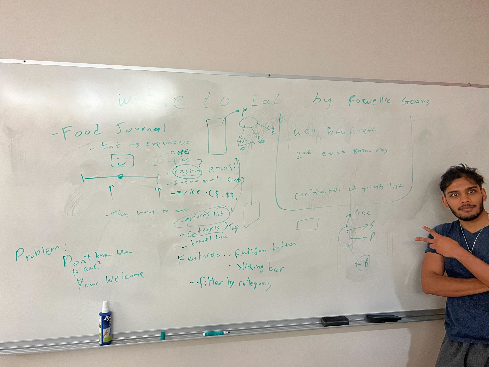
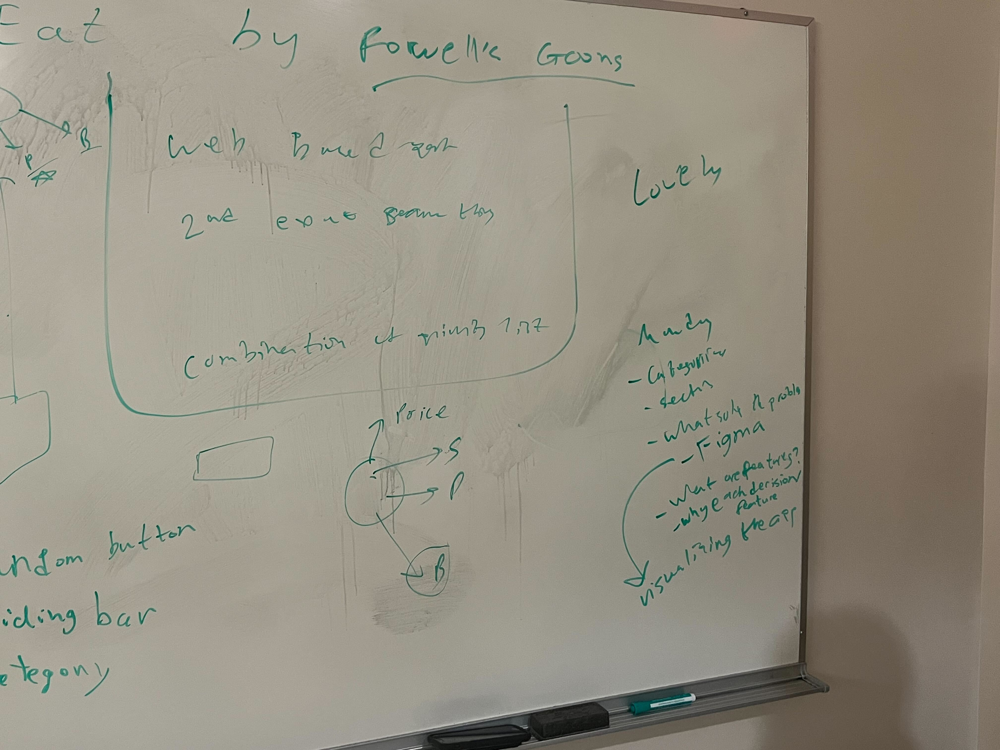

# Meeting Minutes 10-19-2022

## Team 37

## Meeting# 4

## CSE Building Floor 3

### Attendees: Alan Sun, Eustacia Sukarto, James Cole, Jingxin(Finch) Shi, Jungwoon Ko, Lauren Chen, Pethaperumal Natarajan, Raiaan Mortuja, Satvik Singh, Sofie Gmerek

### Everyone Present

### Minutes Taker: Alan Sun

## Agenda:
- Solidify project idea and user stories. 
- Have TA (Allison) nearby for observation & suggestions. 

## Notes:
- Expand on the idea of “Where to eat” 
- Stores restaurant’s experience
    - Notes (text) 
    - Pics 
    - Price range (category: $, $$, $$$)
    - Rating (slider + emoji) 
    - Distance from me
    - Future priority 
  
- Cool features (maybe), local first.
    - Random choice
    - Searchable
    - Filter by…
    - sort by…

- Promise less, do more. Set the right expectations. 
- Next up: user stories (Figma / digital)

## Whiteboard

