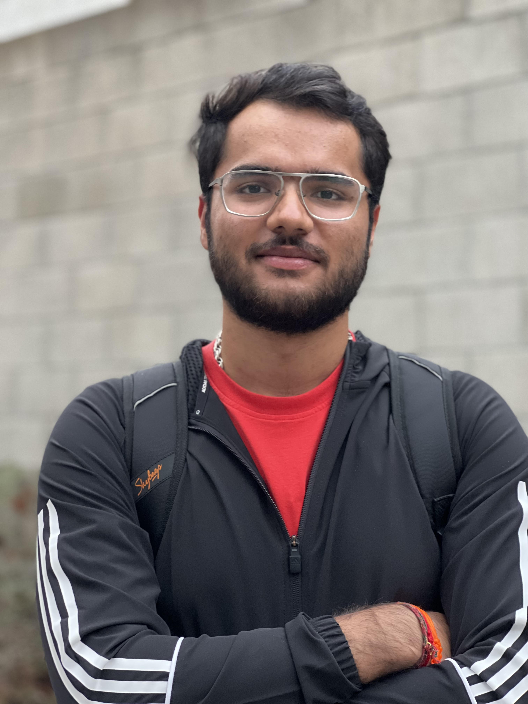
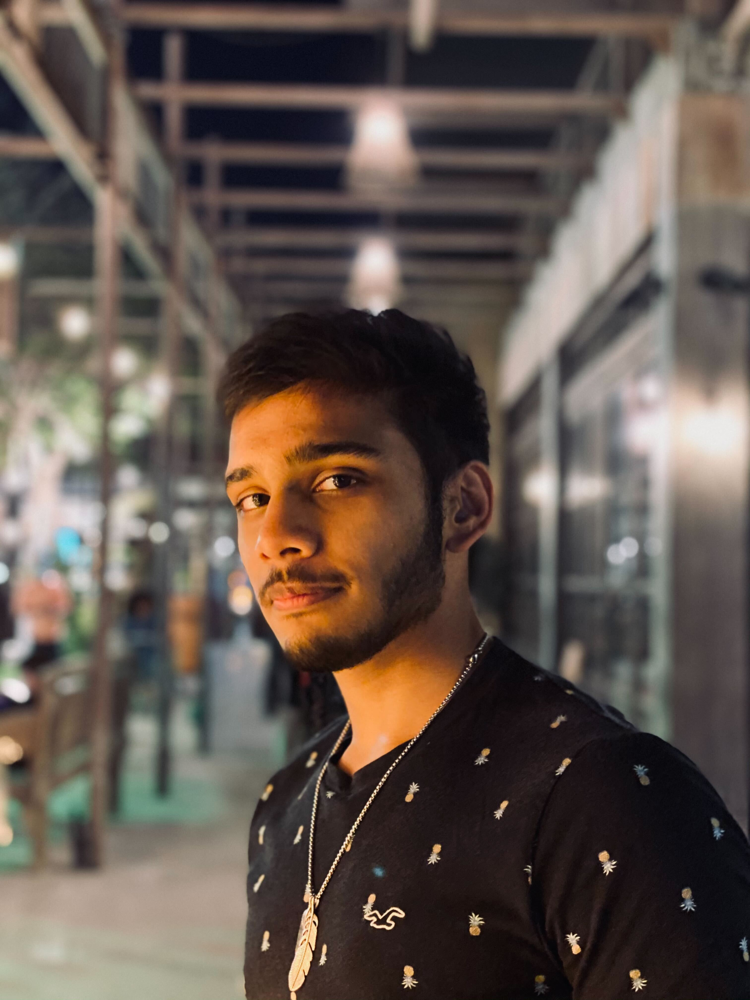
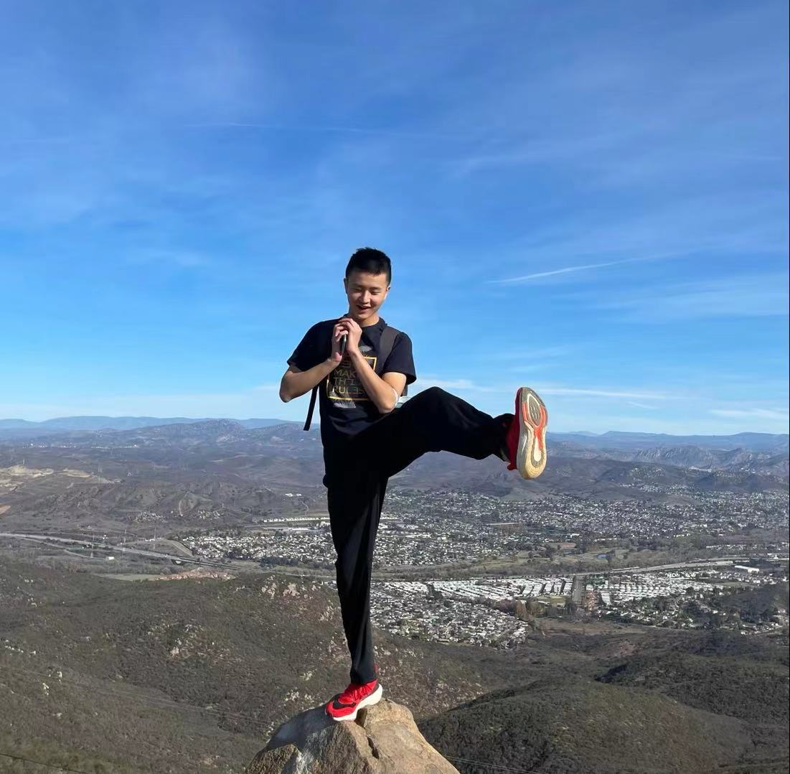
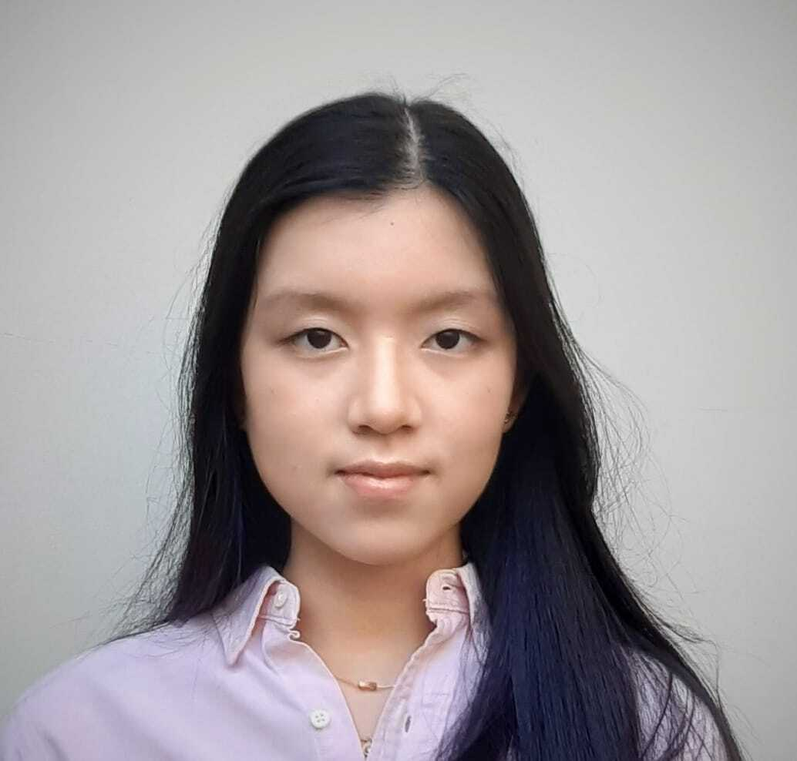
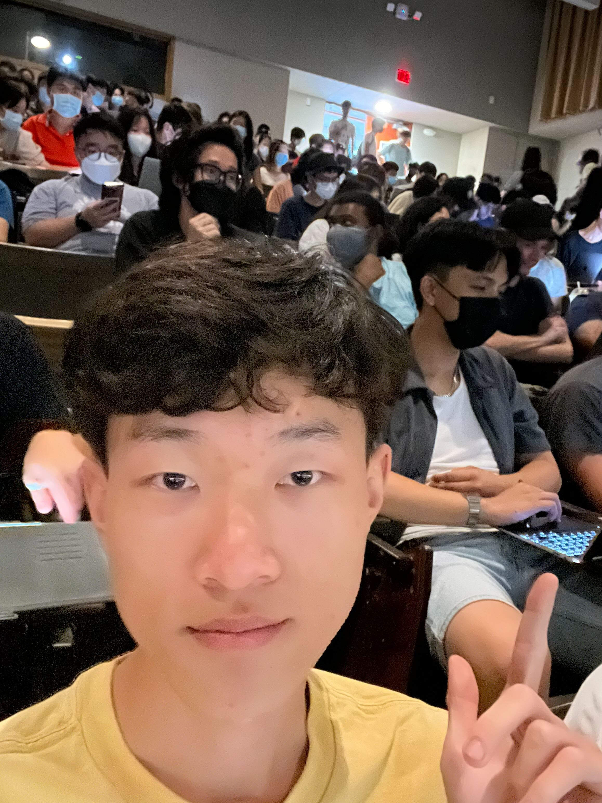

# Powell's Goons

Our content is rated PG37. 

## Who are we
[Satvik Singh](https://link-to-github-page)

[Raiaan Mortuja](https://raiaanm.github.io/Rlab1/)

[Alan Sun](https://alanine42.github.io/CSE110-Lab-0n1/)

[Eustacia Sukarto](https://eustaciasukarto.github.io/cse110-lab01/)

[James Cole](https://link-to-github-page)

[Finch (Jingxin) Shi](https://finchshi.github.io/)

[Jungwoon Ko](https://jungwoonko.github.io/CSE110/)

[Lauren Chen](https://laurennchen.github.io/CSE-110/)

[Pethaperumal Natarajan](https://petha01.github.io/CSE110-Lab-0/)

[Sofie Gmerek](https://www.sofiegmerek.com/)

## Internal documentation

<!-- Your team page should have the team name, brand, any values you think are important, and a roster of all the team members.  The roster should provide a brief overview of each member with a link to their personal Github page.  The team page can include humor or whatever culture makes sense to your team, but keep it reasonable as it may be shown to others.  -->

<!-- For internal documentation -->
